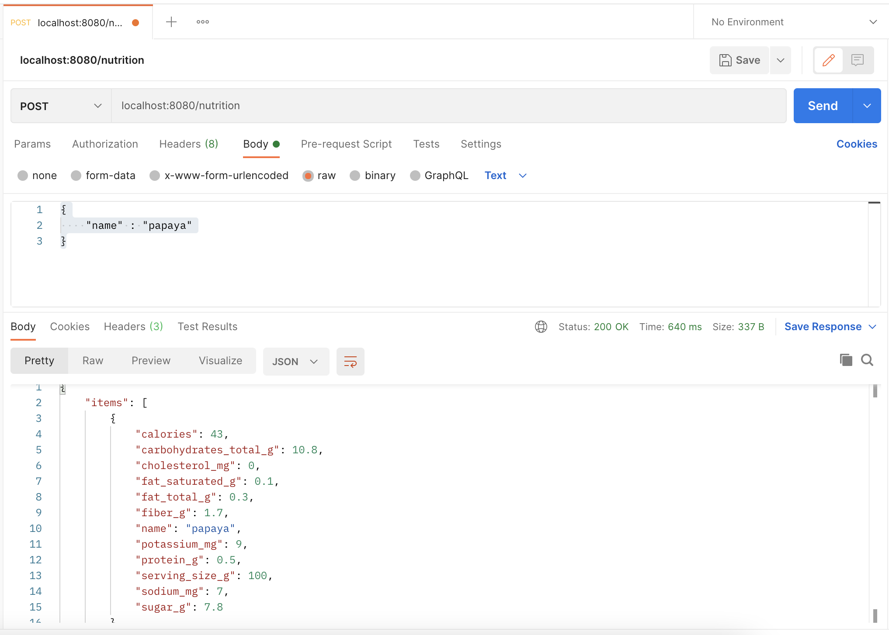

# FruitWatch Backend API

Start of the FruitWatch backend API by Team 12 for ITC303.

## Installation

### Prerequisite

Golang version 1.18 or greater.

### Clone Repo

```sh
git@github.com:MattFuaux/team-12-project.git
```

### Start Go API Server

Change directory to the go backend folder

```sh
cd team-12-project/backend
```

Download the Go API dependancies (list of dependancies are located in the go.mod file)

```sh
go get
```

Start the Go server

```sh
go run .
```

The Go server will start on localhost:8080 by default

## Testing in Postman

Make a post request to localhost:8080/nutrition, navigate to the Body tab (change to raw) and enter in the following JSON:

```
{
    "name" : "papaya"
}
```

The fruit name can be substituted to any fruit. This will make a call to [CalorieNinja](https://calorieninjas.com/) API, retrieve the nutritional info and serve the result back.

Example:


